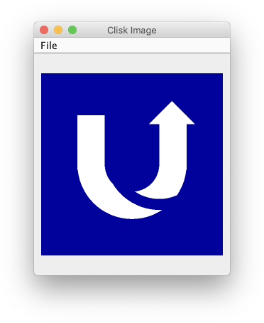
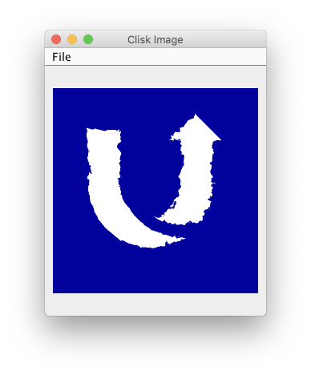

# uSwitch logo drawn procedurally via Clojure

## About
This is a little excercise done for fun during a [Clojure Dojo London meetup](https://www.meetup.com/London-Clojurians/events/wndklqyzfbpb/) at uSwitch office.

The goal was to use a library called [clisk](https://github.com/mikera/clisk) for doing something visually nice.

This repo is the result, it renders the uSwitch logo in a procedural way using the Clisk DSL.

Clean logo:



A bit of distortion to demontrate combination with Clisk base operators:



The logo is made from primitive shapes (circles and rectangles), which are correspondingly scaled/offset and then combined via boolean operations.

This is further coloured and distorted.

Distortion is done just to demonstrate how things can be combined with other Clisk operators. Also, it makes the logo look like gas :)

## Running

```bash
lein run
```